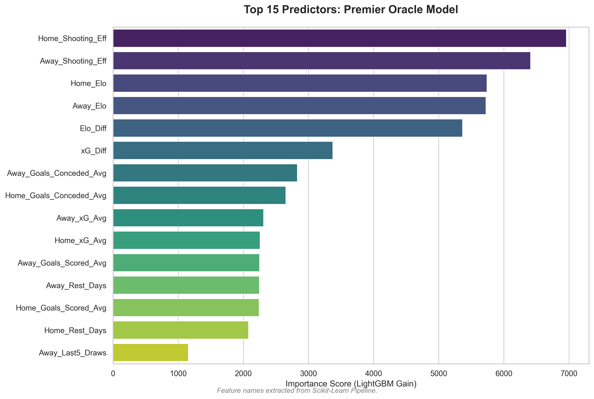
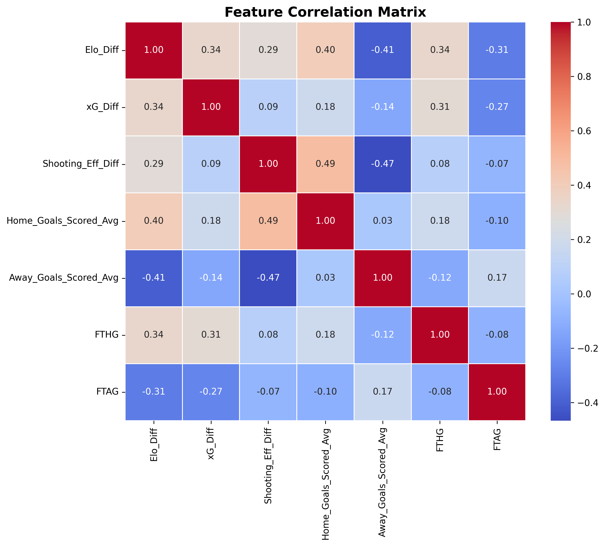
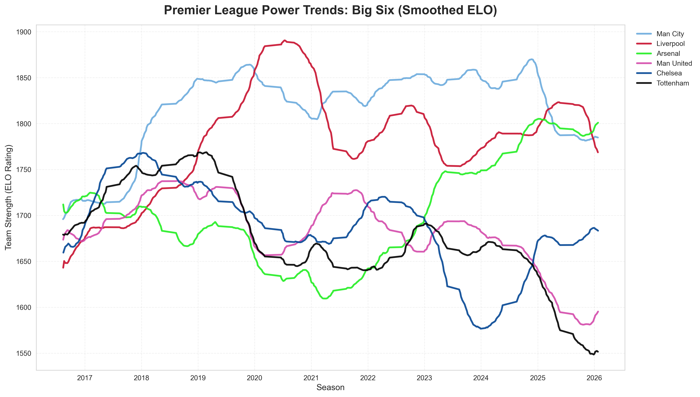
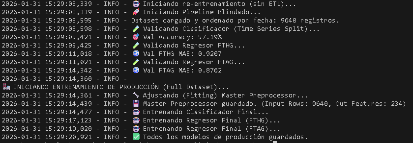

# ⚽ Premier Oracle: Ecosistema MLOps para Predicción Deportiva

Este proyecto es un sistema *end-to-end* que utiliza Machine Learning para predecir resultados de la Premier League. A diferencia de modelos básicos, este ecosistema implementa principios de **MLOps** para garantizar predicciones honestas, escalables y libres de sesgos temporales.

## 🚀 Desafíos Técnicos Superados

### 1. Ingesta y Calidad de Datos (Data Engineering)
- **Scraping de Alto Nivel:** Superación de bloqueos en sitios como FBRef y Understat mediante inyección de JavaScript con `Nodriver`.
- **Normalización de +25 Temporadas:** Fusión de datos históricos con datos modernos, asegurando la consistencia de nombres de equipos y métricas a lo largo de décadas.
- **Almacenamiento Eficiente:** Implementación de archivos **Parquet** para reducir los tiempos de carga en un 80% frente a CSV tradicionales.

### 2. Validación Causal (Time Series Split)
Para evitar el **Data Leakage** (fuga de datos del futuro), reemplacé la validación aleatoria tradicional por un **Time Series Split**. Esto obliga al modelo a aprender exclusivamente del pasado para predecir el futuro, simulando un entorno de producción real.

### 3. Ingeniería de Señal vs. Ruido
- **ELO Ratings:** Implementación de un sistema de fuerza relativa dinámica para capturar la jerarquía de los equipos.
- **EWMA (Exponential Weighted Moving Average):** Suavizado de métricas de eficiencia ofensiva para priorizar la "forma actual" del equipo sobre datos históricos obsoletos.

### 4. Arquitectura de Preprocesamiento Blindada
Uso de `sklearn.base.clone` para aislar el entrenamiento del clasificador y los regresores. Se implementó un **Master Preprocessor** ajustado con el dataset global para asegurar la consistencia matemática en la inferencia.

## 🛠️ Stack Tecnológico
- **Core:** Python (Pandas, NumPy)
- **ML:** LightGBM, Scikit-Learn (HistGradientBoosting)
- **Ingestión:** Scraping modular con `Nodriver` e inyección de JS.
- **Delivery:** Bot de Telegram privado desplegado en **Render**.

## 📊 Métricas de Rendimiento (Validadas)
- **Accuracy (Clasificación):** 57.19%
- **MAE Goles Visitante:** 0.87
- **MAE Goles Local:** 0.92

## 📂 Estructura del Código
- `src/`: Lógica modular de ingeniería de features y predicción.
- `notebooks/`: Análisis exploratorio de datos (EDA) y experimentación.
- `reports/`: Evidencia visual del rendimiento, análisis de features y capturas del producto final.

## 🚀 Producto Final
Las predicciones se entregan a través de un **Bot de Telegram** privado, permitiendo consultas manuales o visualización de la cartelera semanal de la Premier League con un solo botón.

## 🖼️ Visual Intelligence & Audit

### 1. Model Logic & Interpretability
Análisis de qué variables impulsan las decisiones del modelo (LightGBM Gain) y cómo se correlacionan con la realidad.
| Top Predictors | Feature Correlation |
| :---: | :---: |
| <br><sub>*Eficiencia de tiro y ELO son los factores dominantes.*</sub> | <br><sub>*Elo_Diff muestra alta correlación con los Goles Reales.*</sub> |

### 2. Market Insights (Storytelling)
Visualización de la "Era Moderna" de la Premier League a través de nuestro motor de ELO Rating suavizado.

<sub>*Análisis de tendencias de dominancia (2016-Presente). Note la consistencia del Man City vs. la volatilidad del Chelsea.*</sub>

### 3. Production Snapshot
Evidencia de ejecución del pipeline de entrenamiento con validación Time-Series (Jornada 24).

<sub>*Validación Offline: 57.19% Accuracy en clasificación direccional.*</sub>


```mermaid
flowchart TD
    subgraph "☁️ GitHub Actions (Automation Layer)"
        Cron_Fri["🕒 Viernes: Update Fixture"]
        Cron_Wed["🕒 Miércoles: Re-Training"]
        
        Scraper["🕷️ scraper.py<br/>(Cloudscraper)"]
        Trainer["🧠 train_model.py<br/>(Scikit-Learn)"]
        
        Cron_Fri -->|Trigger| Scraper
        Cron_Wed -->|Trigger| Trainer
    end

    subgraph "📂 Data Persistence (Git)"
        Raw[(Raw CSVs)]
        Model_PKL["📦 Model.pkl"]
        
        Scraper -->|Commit Data| Raw
        Raw -->|Load| Trainer
        Trainer -->|Commit Model| Model_PKL
    end

    subgraph "🚀 Production (Render Cloud)"
        Deploy["⚡ Auto-Deploy"]
        API["Flask API"]
        Bot["🤖 Telegram Bot"]
        
        Model_PKL -->|Push Trigger| Deploy
        Deploy --> API
        API <--> Bot
    end

    subgraph "👤 User Interface"
        User((Admin/User))
        User <-->|/predict| Bot
    end
    
    style Cron_Fri fill:#e1bee7,stroke:#4a148c,color:#000
    style Cron_Wed fill:#e1bee7,stroke:#4a148c,color:#000
    style Scraper fill:#ffccbc,stroke:#bf360c,color:#000
    style Trainer fill:#b2dfdb,stroke:#004d40,color:#000
    style API fill:#c5cae9,stroke:#1a237e,color:#000
    style Bot fill:#bbdefb,stroke:#0d47a1,color:#000
    style User fill:#fff,stroke:#333,color:#000 
    ```
