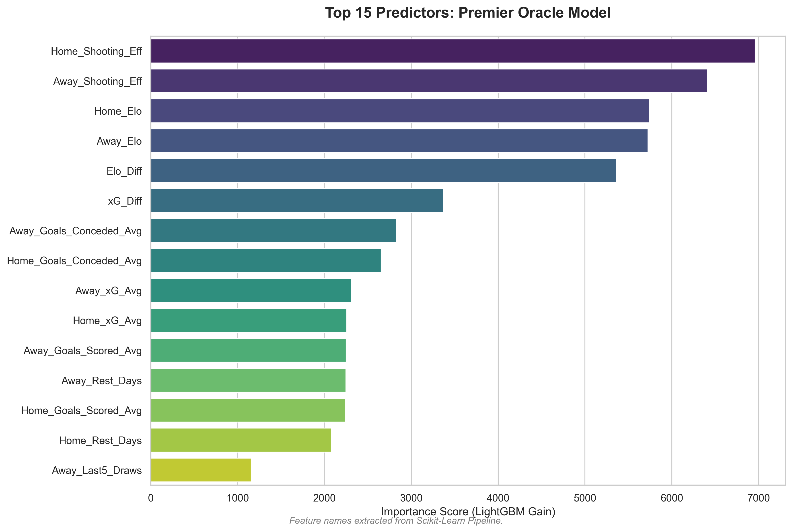
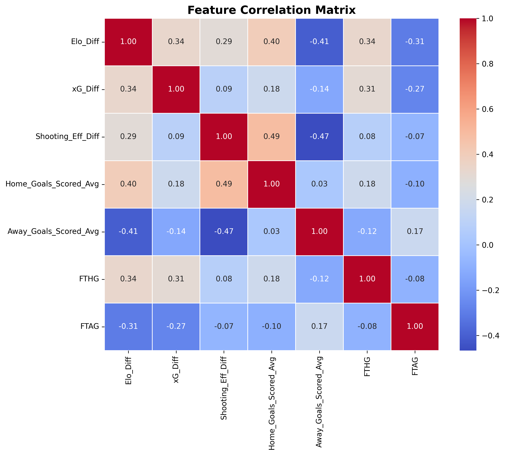
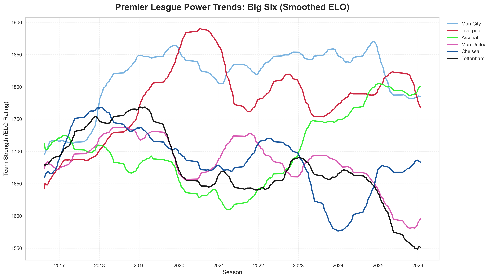
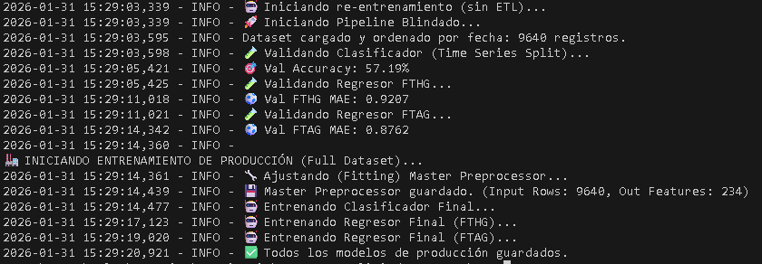

# ⚽ Premier Oracle: MLOps Ecosystem for Sports Prediction

An end-to-end machine learning system engineered to predict Premier League match outcomes. Moving away from static scripts, this ecosystem implements robust **MLOps** principles to deliver reliable, scalable predictions free from temporal leakage.

## 🚀 Technical Challenges Overcome

### 1. Data Engineering & High-Efficiency Ingestion
* **Advanced Web Scraping:** Overcame strict anti-bot mechanisms on football analytics platforms (e.g., FBRef, Understat) using JavaScript injection with `Nodriver`.
* **25+ Season Normalization:** Merged historical datasets with modern metrics, ensuring team naming consistency and entity mapping across decades.
* **Optimized Data Storage:** Migrated to **Parquet** format, reducing dataset load times by ~80% compared to traditional CSV files.

### 2. Causal Validation (Time Series Split)
To eliminate **Data Leakage** (preventing future information from contaminating past features), traditional random cross-validation was replaced with a strictly ordered **Time Series Split**. This forces the model to learn exclusively from historical context, mirroring real-world inference environments.

### 3. Signal vs. Noise Feature Engineering
* **Dynamic ELO Ratings:** Implemented a relative team-strength metric to capture squad hierarchy over time.
* **EWMA (Exponential Weighted Moving Average):** Applied dynamic smoothing to attacking and defensive efficiency metrics, prioritizing current form over stale historical averages.

### 4. Hardened Preprocessing Architecture
Utilized `sklearn.base.clone` to strictly isolate classifier training from regressor logic. Implemented a **Master Preprocessor** pipeline fitted against the global dataset to guarantee mathematical consistency during inference.

## 🛠️ Tech Stack
* **Core:** Python (Pandas, NumPy)
* **ML & Modeling:** LightGBM, Scikit-Learn
* **Data Ingestion:** Modular Web Scraping (`Nodriver`, JS Injection)
* **Delivery & Infra:** Flask API, GitHub Actions (CI/CD), Telegram Bot API, Render Cloud Platform

## 📊 Performance Metrics (Validated)
* **Classification Accuracy:** 57.19%
* **Away Goals MAE:** 0.87
* **Home Goals MAE:** 0.92

## 📂 Code Structure
* `src/`: Modular logic for feature engineering, training pipelines, and prediction.
* `notebooks/`: Exploratory Data Analysis (EDA) and experimental feature engineering.
* `reports/`: Performance visual audits, feature importance matrices, and product execution snapshots.

## 🚀 Production Deployment
Predictions are served via a private **Telegram Bot** connected to a **Flask API**. Users can query individual match forecasts or request weekly fixture lists with a single command.

## 🖼️ Visual Intelligence & Audit

### 1. Model Logic & Interpretability
Analysis of feature drivers behind model decisions (LightGBM Gain) and their correlation with real-world target variables.
| Top Predictors | Feature Correlation |
| :---: | :---: |
| <br><sub>*Shooting efficiency and Dynamic ELO are dominant factors.*</sub> | <br><sub>*Elo_Diff shows strong linear correlation with Actual Goals.*</sub> |

### 2. Market Insights
Visualization of the Premier League's modern era dynamics filtered through the EWMA-smoothed ELO rating engine.

<sub>*Dominance trend analysis (2016–Present). Highlights Manchester City's sustained consistency vs. Chelsea's volatility.*</sub>

### 3. Production Snapshot
Audit snapshot of the offline training pipeline using time-series cross-validation (Gameweek 24).

<sub>*Offline Validation: 57.19% directional classification accuracy.*</sub>

## ⚙️ System Architecture Flow

```mermaid
flowchart TD
    subgraph "☁️ GitHub Actions (Automation Layer)"
        Cron_Fri["🕒 Friday: Update Fixture"]
        Cron_Wed["🕒 Wednesday: Re-Training"]
        
        Scraper["🕷️ scraper_fixtures.py<br/>(Nodriver / Requests)"]
        Trainer["🧠 train_model.py<br/>(Scikit-Learn)"]
        
        Cron_Fri -->|Trigger| Scraper
        Cron_Wed -->|Trigger| Trainer
    end

    subgraph "📂 Data Persistence (Git)"
        Raw[(Raw CSVs / Parquet)]
        Model_PKL["📦 Model.pkl"]
        
        Scraper -->|Commit Data| Raw
        Raw -->|Load| Trainer
        Trainer -->|Commit Model| Model_PKL
    end

    subgraph "🚀 Production (Render Cloud)"
        Deploy["⚡ Auto-Deploy"]
        API["Flask API"]
        Bot["🤖 Telegram Bot"]
        
        Model_PKL -->|Push Trigger| Deploy
        Deploy --> API
        API <--> Bot
    end

    subgraph "👤 User Interface"
        User((Admin/User))
        User <-->|/predict| Bot
    end
    
    style Cron_Fri fill:#e1bee7,stroke:#4a148c,color:#000
    style Cron_Wed fill:#e1bee7,stroke:#4a148c,color:#000
    style Scraper fill:#ffccbc,stroke:#bf360c,color:#000
    style Trainer fill:#b2dfdb,stroke:#004d40,color:#000
    style API fill:#c5cae9,stroke:#1a237e,color:#000
    style Bot fill:#bbdefb,stroke:#0d47a1,color:#000
    style User fill:#fff,stroke:#333,color:#000